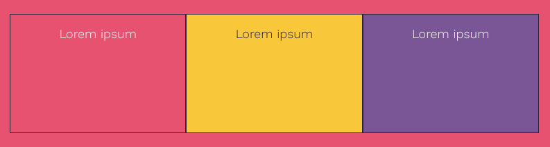

Utilise la classe `primary`, `secondary` ou `tertiary` pour définir les couleurs de l'arrière-plan et de la police.

Ces classes utilisent les couleurs définies dans la palette de polices en haut du fichier `style.css`.

--- code ---
---
language: html
filename: index.html
line_numbers: false
---

<section class="wrap">
    

        
Lorem ipsum

    

    

        
Lorem ipsum

    

    

        
Lorem ipsum

    

</section>

--- /code ---
