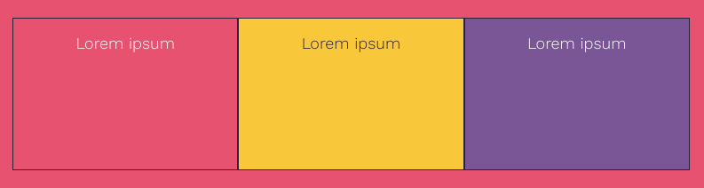

使用 `primary`, `secondary`, 或者 `tertiary` 类来设置背景和字体颜色。

这些类使用`style.css`顶部的字体调色板中设置的颜色。

--- code ---
---
language: html
filename: index.html
line_numbers: false
---

<section class="wrap">
    

        
Lorem ipsum

    

    

        
Lorem ipsum

    

    

        
Lorem ipsum

    

</section>

--- /code ---
